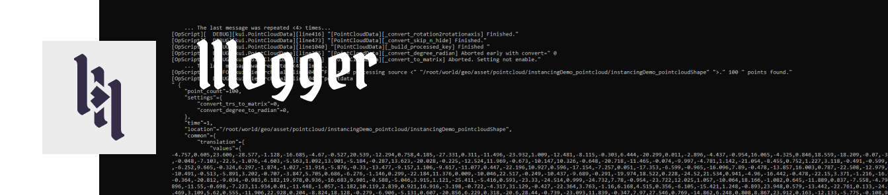

# llloger

A simple lua logging module inspired from Python's one.
Originaly intended to be use with Foundry's Katana software, OpScript feature.

# Features

- "level" system where you can define what level of message is allowed to be displayed.
- Multiples logger with different log level can be created in the same script.
- Convert tables and nested tables to a human-readable string (see settings).
- Multiples arguments can be passed : `logger:debug("text", 69, {"table"})`
- Should be loop safe (no string concatenation)
- String formatting settings class with options to format the displayed output:
  - number : round decimals
  - string : display literal quotes around strings
  - tables : display tables with line breaks or as one-line
  - tables : indent amount for multi-line tables
  - tables : toggle display of tables indexes
  - tables : maximum table length allowed before the table is forced to one-line
- Options for avoiding message flooding where the same message is repeated a lot of time

# Documentation

> Or see the [./doc directory](doc).

# Legal

Apache License 2.0

See [LICENSE.md](LICENSE.md) for full licence.

- ✅ The licensed material and derivatives may be used for commercial purposes.
- ✅ The licensed material may be distributed.
- ✅ The licensed material may be modified.
- ✅ The licensed material may be used and modified in private.
- ✅ This license provides an express grant of patent rights from contributors.
- 📏 A copy of the license and copyright notice must be included with the licensed material.
- 📏 Changes made to the licensed material must be documented

You can request a specific license by contacting me at [monsieurlixm@gmail.com](mailto:monsieurlixm@gmail.com) .

 
