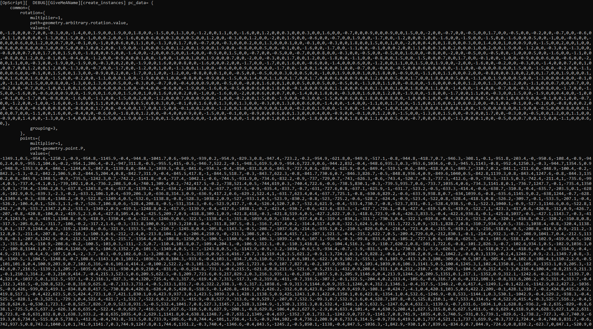

#  Index

Welcome on the lllogger module's documentation.

[](../README.md)
[](API.md)


# Installation

These instructions are mainly towards Katana users, for external use you
can use it as a traditional lua module. But see [developer.md](DEVELOPER.md#using-outside-of-katana)
for details.

You have 2 options to install the script :

## Module

_(Recommended)_

Save the [../lllogger.lua](../lllogger.lua) file somewhere.

Add the location of the `lllogger.lua` to the Katana `LUA_PATH` env variable.
See [8.1 – The require Function](https://www.lua.org/pil/8.1.html) for more details.

Example for windows batch file :

```batch
:: the ? will be replaced by the string in `require("...")`
set "LUA_PATH=%LUA_PATH%;Z:\somedir\katana\?.lua"
```

You can then import it in your OpScript as :

```lua
local logging = require("lllogger")
```


## Insert inline

Paste the code of the [../lllogger.lua](../lllogger.lua) at
the top of your OpScript code.

Create a new logger instance :

- Delete the last line `return {...}`.
- Swap it with `local logger = get_logger(nil, "YourLoggerName")`. This creates a
new logger instance named `YourLoggerName`.

You can then use the `logger` as :
```lua
logger:debug("my message")
```

✅ Pros of this method :
- No dependencies, you can share the Katana file/ OpScript node to anyone easily.

❌ Cons :
- Code is muuuch longer and make it very messy.
- Updating the lllogger module and propagating change to all ever used instances
is super-hard.

# Use

To log a message you can use the following methods :

```lua
logger:debug("any object")
logger:info("any object")
logger:warning("any object")
logger:error("any object")
```

By default, the logger level is set to `debug`.
To change it you can use :

```lua
logger:set_level("debug")
logger:set_level("info") 
logger:set_level("warning")
logger:set_level("error")
```

The message will be printed only if the logger level has a lower 'weight'
than the message's level.

If the level is to `warning` for exemple, only messages of level `warning` and `error`
will be logged. Other messages are ignored.

Here is a basic startup snippet :

```lua
local logging = require("lllogger")
local logger = logging:get_logger("Test")

logger:debug("this is a debug message")

logger:set_level("error")

logger:info("this message will not be displayed")
logger:error("this message is displayed")
```


## Formatting

version 9+ include some formatting options to customize the displayed result.
These settings are stored on the logger in the `formatting` key. You can then 
use the functions or directly override the keys :

```lua
local logging = require("lllogger")
local logger = logging:get_logger("TestFmt")

-- these 2 lines does the same thing
logger.formatting:set_tbl_linebreaks(true)
logger.formatting.tables.linebreaks = true

-- All methods, arg is the default value :
logger.formatting:set_num_round(3)
logger.formatting:set_str_display_quotes(false)
logger.formatting:set_tbl_display_indexes(false)
logger.formatting:set_tbl_linebreaks(true)
logger.formatting:set_tbl_length_max(50)
logger.formatting:set_tbl_indent(4)
logger.formatting:set_tbl_display_functions(true)
logger.formatting:set_blocks_duplicate(true)
logger.formatting:set_display_context(true)

```

Example with a table containing lot of data, table is displayed as multiples
lines except for the tables with a lot of values.



### context

Sometimes you might need a bit of "execution" context to debug more easily.
Like for error messages. That's where the `logger.formatting:set_display_context(true)`
come in play. If set to false of course all the under doesn't apply.

By default, only error message will prefix the message with some context to 
help debugging. It's a string made of the name of the function + the line
at which the logger was called at. But you could swap this context with anything you
want and also display one for other log levels :

```lua
logger:set_level("debug")

logger:info("Without context.")
logger:error("With context.")
logger.ctx = "Called from line 5 !"
logger:info("With context.")
logger:info("Without context.")  -- ctx was automatically reset

logger.formatting:set_display_context(false)
logger:debug("Without context.")
logger:error("Without context.")
logger.ctx = "Context from line12 !"
logger:info("Without context.")
```


# Misc

As at the end, `lllogger` use `print()` to display the content. 
You should remember that in Katana, printing in the console has a latency cost. 
So having just 3 message log times the number of location the script is excuted
to can lead to crappy pre-render performance.

To avoid this you can abuse of `logger:debug` during development and then switch
the logger's level to `info` at publish time and make
sure there is only a few `logger:info` calls.

# Project

> https://github.com/MrLixm/llloger/projects/1

Feel free to open issues for bugs/feature request or anything else.

You can check the project board above for current development status.


---

[](../README.md)
[](API.md)
