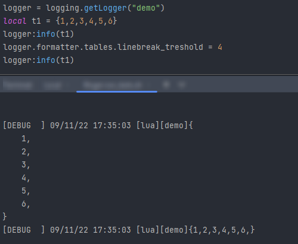

#  Index

Welcome on the lllogger module's documentation.

[](../README.md)
[](API.md)


# Installation

Save the [../lllogger.lua](../lllogger.lua) file somewhere.

Add the location of the `lllogger.lua` to the `LUA_PATH` env variable.
See [8.1 – The require Function](https://www.lua.org/pil/8.1.html) for more details.

Example for windows batch file :

```batch
:: the ? will be replaced by the string in `require("...")`
set "LUA_PATH=%LUA_PATH%;Z:\somedir\katana\?.lua"
:: where `katana/` contains `lllogger.lua`
```

You can then import it in your lua script as :

```lua
local logging = require("lllogger")
```

# Use

To log a message you can use the following methods :

```lua
logger:debug("any object")
logger:info("any object")
logger:warning("any object")
logger:error("any object")
```

You can log mutltiple type of object that will be concatenated :

```lua
local result = {["key"] = "value"}
logger:info("[doSomething] result is ", result)
```

## levels

By default, the logger level is set to `INFO`.
To change it you can use :

```lua
local logging = require("lllogger")
local logger = logging.getLogger("demo")

logger:setLevel(logging.DEBUG)
logger:setLevel(logging.INFO) 
logger:setLevel(logging.WARNING)
logger:setLevel(logging.ERROR)
```

The message will be printed only if the logger level has a lower 'weight'
than the message's level.

If the level is to `warning` for exemple, only messages of level `warning` and `error`
will be logged. Other messages are ignored.

Here is a basic startup snippet :

```lua
local logging = require("lllogger")
local logger = logging:getLogger("Test")

logger:debug("this is a debug message")

logger:setLevel(logging.ERROR)

logger:info("this message will not be displayed")
logger:error("this message is displayed")
```

For now there is no hierarchical system that link a logger to another. So set
the LEVEL on multiple logger, you can use the `logging.propagateLoggerLevel` function :

```lua
local logging = require("lllogger")

local loggera = logging.getLogger("alpha.foo")
local loggerb = logging.getLogger("beta.foo")
local loggeraa = logging.getLogger("alpha.bar")
local loggeraaa = logging.getLogger("alpha.bar.test")

loggera:debug("you should NOT read that")
loggerb:debug("you should NOT read that")
loggeraa:debug("you should NOT read that")
loggeraaa:debug("you should NOT read that")

logging.propagateLoggerLevel("alpha", logging.DEBUG)

loggera:debug("you should read that")
loggerb:debug("you should NOT read that")
loggeraa:debug("you should read that")
loggeraaa:debug("you should read that")
```


## Formatting

### template

A default template if provided to format messages, but you might want to modify
it. You can by simply modifying the `template` attribute on the logger's `Formatter` instance :

```lua
local logging = require("lllogger")
local logger = logging:getLogger("TestFmt")

logger.formatter:set_template("[{level:-7}] {time} [{appctx}][{logger}]{message}")
-- same
logger.formatter.template = "[{level:-7}] {time} [{appctx}][{logger}]{message}"
```

The tokens available are :

- `time` : time at which the logger message is created
- `message`: message passed to the logger call
- `logger`: name of the logger
- `level`: level of the message
- `appctx`: global context from where the logger is called, editable via the `LLLOGGER_CONTEXT`
environment variable.

They are all optional.

You have the ability to specify string formatting options after a colon like
`logger.formatter:set_template("[{level:-7}]")`. Those options are used by
the `string.format("%{options}s", token)` function and you can see all of them
available in the [cpp sprintf documentation](https://en.cppreference.com/w/c/io/fprintf#Parameters).


> You can format the `time` token using `Formatter.time_format` attribute.
> Default is `"%c"` but check https://www.lua.org/pil/22.1.html for all tokens
> available to format time.

### types formatting

You can customize how does the logger react
with the different lua types :

```lua
local logging = require("lllogger")
local logger = logging:getLogger("TestFmt")

-- these 2 lines does the same thing
logger.formatting:set_tbl_linebreaks(true)
logger.formatting.tables.linebreaks = true

-- All methods, arg is the default value :
logger.formatting:set_num_round(3)
logger.formatting:set_str_display_quotes(false)
logger.formatting:set_tbl_display_indexes(false)
logger.formatting:set_tbl_linebreaks(true)
logger.formatting:set_tbl_length_max(50)
logger.formatting:set_tbl_indent(4)
logger.formatting:set_tbl_display_functions(true)
```

Quick example with a simple table :




### blocks duplicate

Nobody likes when a logs message repeat multiple time the same info, especially
when you are in a big loop and someone forgot to disable the logging call, or
you had to log in that loop.

To prevent this, duplicates are not logged and once a new log message is no more
a duplicate, we log a small message to tell how many duplicates were avoided.

This is enabled by default but can be disabled using `Formatter.blocks_duplicate`.

You can also configure the template for this message using `Formatter.template_duplicate`

```lua
logger.formatting:set_blocks_duplicate(true)
logger.formatting.template_duplicate = "    [{logger}] The last message was repeated <{nrepeat}> times ..."
```

The tokens available for the template are :
- `time` : time at which the logger message is created
- `logger` : name of the logger
- `appctx` : global context from where the logger is called, editable via the `LLLOGGER_CONTEXT`
environment variable.
- `nrepeat` : number of time the last log message was repeated


# Output

`lllogger` symply output to stdout by using a simple call to the `print()` function.

Remember that an excessive number of call to the print() function can slow down
your program so be aware of it.

# Environment variables

## `LLLOGGER_CONTEXT`

This is available as a token in the `Formatter` template and allow to distinguinsh
lllogger messages from other languages loggers.

Default value if `lua` if not specified.

## `LLLOGGER_LEVEL_OVERRIDE`

**ALL** logger instances will use this level instead of the one set on them.

Values to set is the name of a level as defined in `logging.LEVELS` keys which are :

- "DEBUG"
- "INFO"
- "WARNING"
- "ERROR"


---

[](../README.md)
[](API.md)
